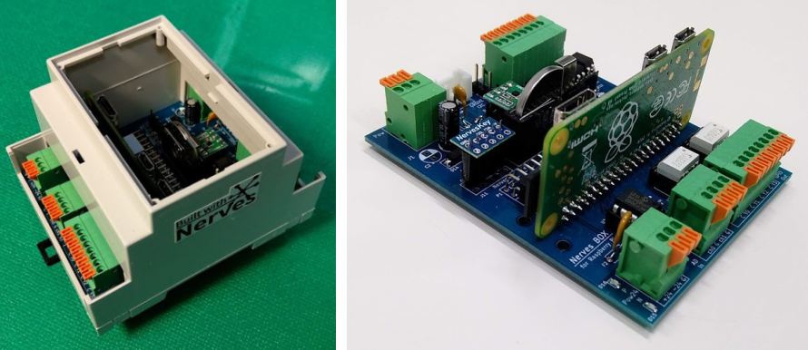
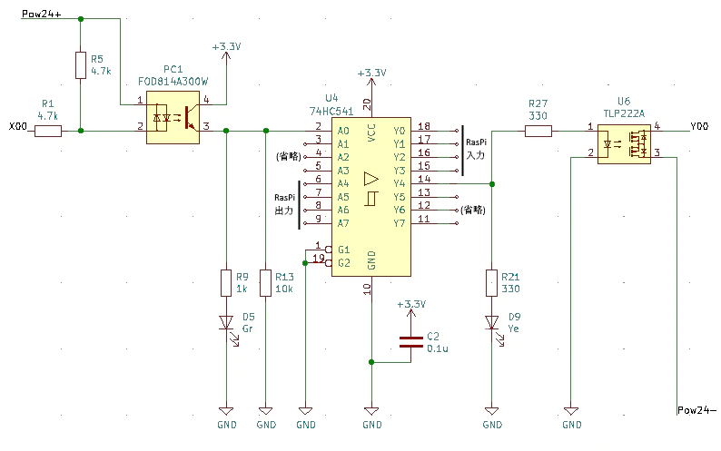

# Nerves BOX for Raspberry Pi

## はじめに

このボードは、産業用に使用される機器（例：24V駆動のスイッチ、センサー、リレーなど）をRaspberry Piへ接続できるようにします。

詳しくは、Qiitaの記事「[Elixir/NervesでPLC(多機能リレー)を作ってみた](https://qiita.com/myasu/private/a6664d3a3c76503affc7)」をご覧ください。

## 仕様

|機能|仕様|補足|
|:--|:--|:--|
|出力|4ch（フォトリレー絶縁）|シンク（NPN）・ソース（PNP）駆動切り替え可能。各chの動作確認LEDあり。|
|入力|4ch（フォトカプラ絶縁）|〃|
|AD変換|10bit 2ch|非絶縁・入力保護のダイオード付き|
|時刻保持|リアルタイムクロックDS1307|ボタン電池でバックアップ|
|GROVEコネクタ|あり、I2C x 1|5V電源タイプ|
|外部UART端子|あり x 1|RaspberryPiのUARTに直結|
|電源|5V系/24V系は個別に供給|それぞれポリスイッチ（過電流防止）あり|

**J5, J7の接続**

|対応表|GPIO（BCM表記）|本機の端子|
|:--|:--|:--|
|入力|12|X0|
|〃|16|X1|
|〃|20|X2|
|〃|21|X3|
|出力|6|Y0|
|〃|13|Y1|
|〃|19|Y2|
|〃|26|Y3|

**J2の接続**

|駆動したい方法|Pow24+In|Pow24-In||D16|D13||X側COM端子|Y側COM端子|
|:--|:--|:--|:--|:--|:--|:--|:--|:--|
|シンク|+24V|GND|→|点灯|消灯||GND|+24V|
|ソース|GND|+24V|→|消灯|点灯||+24V|GND|

## 作り方

[Manual](doc/README_pcb.jp.md)をご覧ください。
